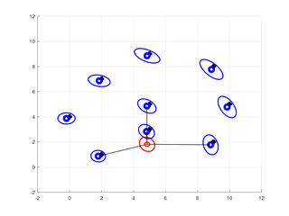

# Description

This is one (of many) project from the University of Bonn Robot Mapping course taught by Cyrill Stachniss. The project consists of a stripped-down version of EKF (Extended Kalman Filter) SLAM. This implementation include the following:

* Implementation of odometry motion model (rotation, translation, rotation)
* Implementation of range-bearing sensor model
* Estimates of landmark and robot positions, with assumed data correspondences

